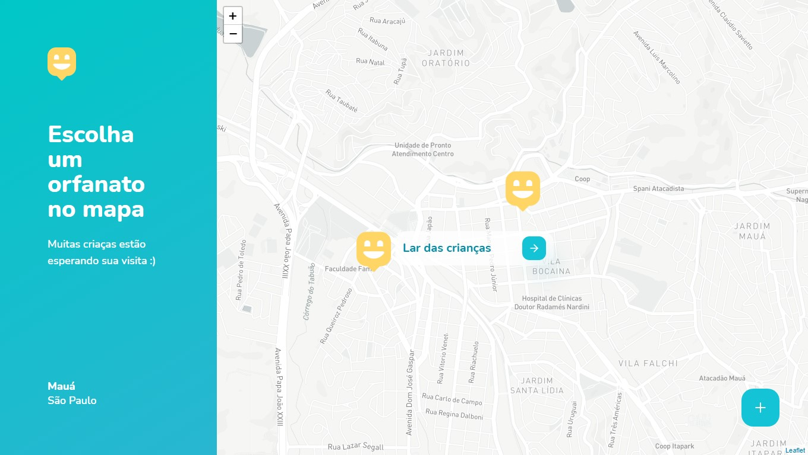

<h2 align="center">
  
  
  
  
</h2>

<h1 align="center">
  
</h1>

## 🔎 Sobre o projeto

Happy é uma plataforma para orfanatos, ligando quem quer ajudar aqueles que presisam ser ajudados.

Parte desse projeto foi desenvolvido na Next Level Week 3.

&nbsp;

## 🖥 Layout

O layout completo do projeto pode ser visto na ferramenta de design de interface **Figma**
- [Layout web](https://www.figma.com/file/Y7sHzKwqD7JUpYjhyS8lDm/Happy-Web-2.0)
- [Layout mobile](https://www.figma.com/file/vXzfEAGZIYKUeeeVW8uGQe/Happy-Mobile)

&nbsp;

<b>Landing Page</b>

  

&nbsp;

<b>Mapa de com orfanatos</b>

  

&nbsp;

<b>Fluxo de cadastro de orfanatos</b>

  

&nbsp;

&nbsp;

## ⚙️ Tecnologias e sua aplicação no projeto
- [typeScript](https://www.typescriptlang.org/) é um super conjunto que extende a linguagem JavaScript adicionando tipagem

&nbsp;

- **back-end**
  - [nodeJs](https://nodejs.org/en/) é um ambiente de execução Javascript server-side, usado para a construção do código
  - [@sendgrid/mail](https://sendgrid.com/docs/for-developers/sending-email/quickstart-nodejs/) é a api do serviço SendGrid, usado para a entrega de emails transacionais de troca de senha de contas
  - [bcrypt](https://www.npmjs.com/package/bcrypt) é uma biblioteca pra ajudar a fazer o hash de senhas, usado para sua encriptação
  - [cors](https://www.npmjs.com/package/cors) é um middleware para o express, usado para a limitação do acesso a API do back-end
  - [express](https://expressjs.com/pt-br/) é uma framework para aplicativos web js, varios de seus recursos foram usados
  - [jade](https://www.npmjs.com/package/jade) é uma engine de tamplate HTML, usado na conversão de arquivos html em strings para utilização nos e-mails enviados
  - [jsonwebtoken](https://www.npmjs.com/package/jsonwebtoken) é uma implementação dos JSON Web Tokens, usado para a geração de tokens de acesso, ajudando nos sistemas de login da aplicação
  - [multer](https://www.npmjs.com/package/multer) é um middleware para lidar com multipart/form-data, usado para o upload de arquivos no servidor
  - [typeorm](https://typeorm.io/#/) é uma Object Relational Mapper, usado na integração com o banco de dados, relacionando os dados aos objetos que os representam 
  - [yup](https://www.npmjs.com/package/yup) é um contrutor e validador de esquemas de objetos, usado na validação das requisições ao servidor 
 
 
&nbsp;

 
- **Front-end Web**
  - [react](https://reactjs.org/) é uma biblioteca de criação de interfaces, usado na criação de todas as interfaçes da aplicação 
  - [axios](https://www.npmjs.com/package/axios) é um cliente HTTP baseado em promisses, usado na conexão 
  - [email-validator](https://www.npmjs.com/package/email-validator) é um módulo simples de validação de e-mails
  - [leaflet](https://leafletjs.com/) é uma biblioteca de mapas interativos, usado para a criação dos mapas interativos da aplicação
  - [redux](https://redux.js.org/introduction/getting-started) é uma biblioteca de gerenciamento de estados da aplicação, usado para auxiliar o sistema de login e de áreas restritas
  
  
&nbsp;

  
- **Front-end Mobile**
  - [react-native](https://reactnative.dev/) é uma framework para desenvolvimento mobile
  - [expo](https://expo.io/) é uma plataforma que auxilia o desenvolvimento com react-native
