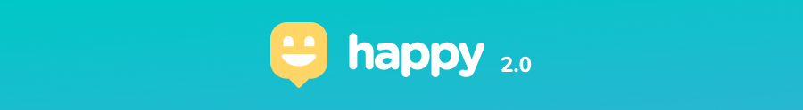
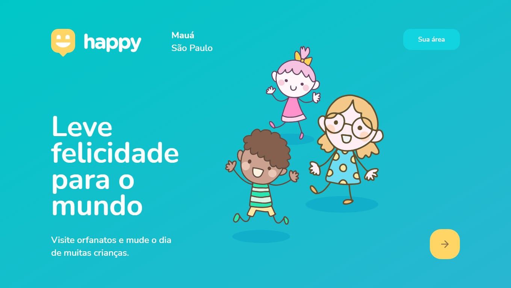

<h2 align="center">
  
  
  
  
</h2>

  

## 🔎 Sobre o projeto

Happy é uma plataforma para orfanatos, ligando quem quer ajudar aqueles que presisam ser ajudados.

Parte desse projeto foi desenvolvido na Next Level Week 3.

&nbsp;

&nbsp;

## O projeto

<b>Landing Page</b>

  

&nbsp;

<b>Mapa de com orfanatos</b>

  

&nbsp;

<b>Fluxo de cadastro de orfanatos</b>

  

